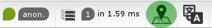
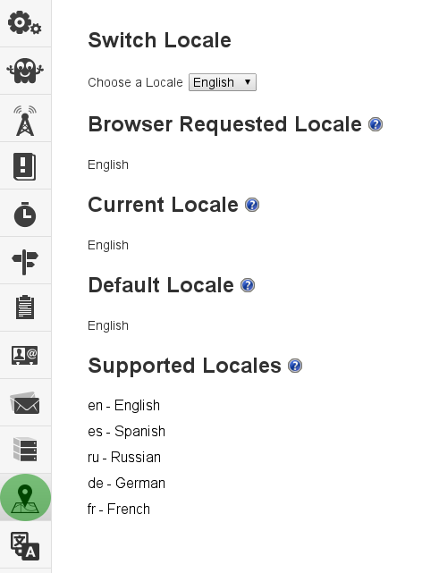

Locale
=========

Web Developer Toolbar
---------------------

As stated in the [configuration](configuration.md) section, if you set the setting 'locale_wdt' to true, it will be enabled and show within the Web Developer Toolbar, as seen here, highlighted in green.

Profiler Panel
--------------
The profiler panel shows the locale information for the currently rendered page.

The switch locale section allows a user to switch between the different supported locales. 

The browser requested locale is the accept-language attribute from the page request headers, converted into human readable form.  

The current locale section describes the locale as it was used for the currently rendered page.

The default locale section is factored by the app/config settings as defined by default_locale.  

The supported locales sections is a list of the supported locales, and their associated human readable form.
