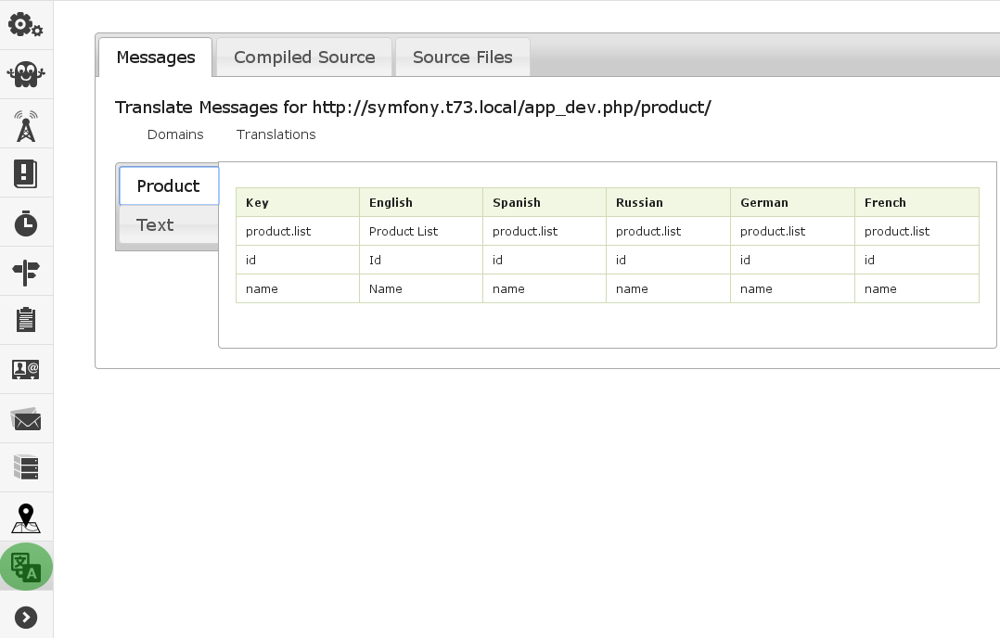

Translation
===========

Web Developer Toolbar
---------------------

The translation tool for the profiler can be seen in the toolbar as highlighted below in green.

---

Profiler Messages
--------------

The messages tab shows the various keys and messages for each domain for the profiled page.

* Domains - The different domains used on the profiled page
* Translations - The different keys and translations for the different supported locales

Profiler Compiled Source
--------------

The compiled source tab shows the full html for the profiled page. This is useful to see where different strings may have been left untranslated.

Profiler Source Files
--------------

The source files tab shows the source code for the various twig files used for the profiled page. This is useful to see where the various translation filters are located at. Each file path can be clicked to expand or contract each panel section for ease of viewing.

